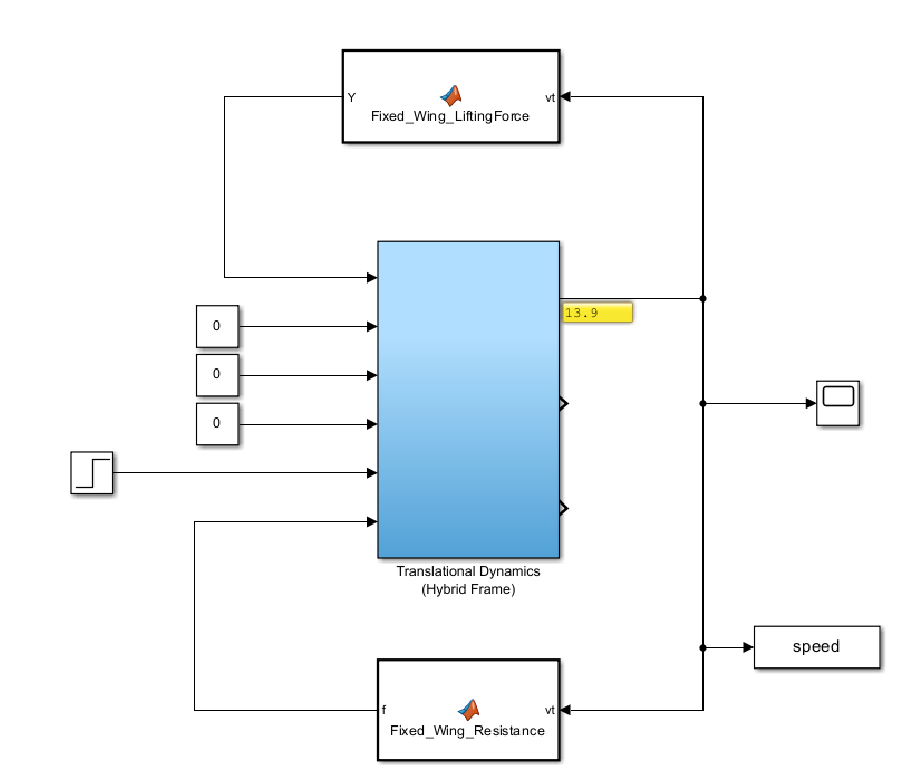
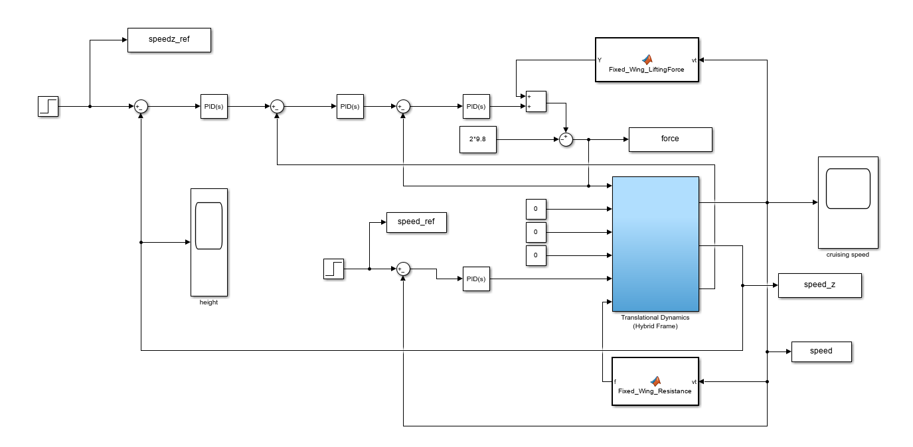
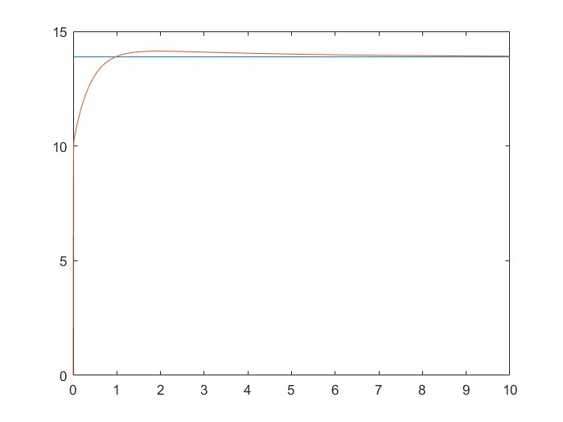
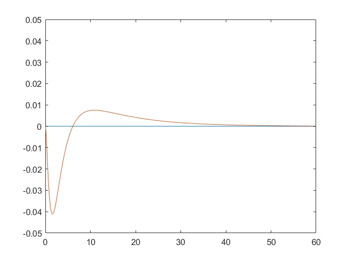

# Control VTOL fixed-wing UAV via PID
This work can be seen as my own initial practice of scientific research, so it has no much value, but a reference for relative research.

&nbsp;
&nbsp;
&nbsp;
&nbsp;

The target in this task is to **adjust cruising speed** and **maintain the stability of height** in the transition flight stage.

Then start to analyse motion of this UAV, 

in order to **get the variables** which can directly impact on the target above,

and **adjust the relative parameters** which can make control effect more ideal.
  
&nbsp;
&nbsp;
&nbsp;
&nbsp;

Let us focus on the fixed-wing part (because rotor part is widely known).

**The lifting force** by the fixed-wing is following:

$F_{fwt} = 0.5{C_p} \rho S{v_t}^2$

**The resistant force** by the fixed-wing is following:

$f = 0.5{C_d}{\rho}S{v_t}^2$

**The translational motion** can be shown as:

$m{\dot{v_t}} = T_t - f - mgsin{\theta}$

Then according above, make a kind of VTOL fixed-wing UAV **model** ↓ (This UAV is 2kg).

And use **one PID controller** to adjust the max cruising speed and **a cascaded PID controller** to maintain the stability of altitude.

The result is below.

**This is cruising speed curve**

**This is height stability curve**

